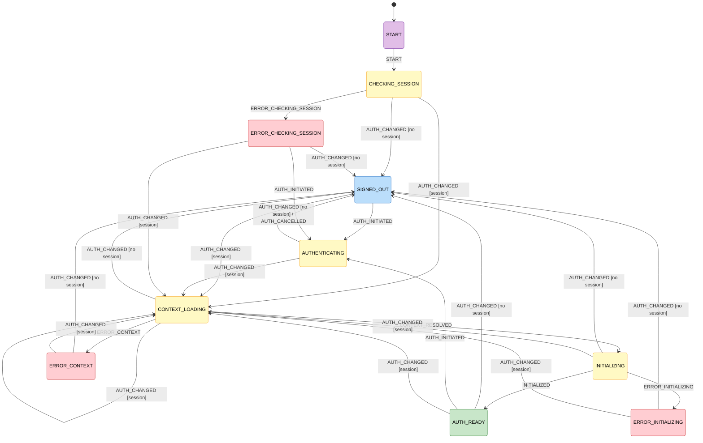

# Supamachine State Machine

> Auto-generated by `pnpm flowchart` — do not edit manually.

## Transition Table

| From | Event | To |
| ---- | ----- | -- |
| START | START | CHECKING_SESSION |
| CHECKING_SESSION | AUTH_CHANGED [session] | CONTEXT_LOADING |
| CHECKING_SESSION | AUTH_CHANGED [no session] | SIGNED_OUT |
| CHECKING_SESSION | ERROR_CHECKING_SESSION | ERROR_CHECKING_SESSION |
| AUTHENTICATING | AUTH_CHANGED [session] | CONTEXT_LOADING |
| AUTHENTICATING | AUTH_CHANGED [no session] | SIGNED_OUT |
| AUTHENTICATING | AUTH_CANCELLED | SIGNED_OUT |
| ERROR_CHECKING_SESSION | AUTH_CHANGED [session] | CONTEXT_LOADING |
| ERROR_CHECKING_SESSION | AUTH_CHANGED [no session] | SIGNED_OUT |
| ERROR_CHECKING_SESSION | AUTH_INITIATED | AUTHENTICATING |
| SIGNED_OUT | AUTH_CHANGED [session] | CONTEXT_LOADING |
| SIGNED_OUT | AUTH_INITIATED | AUTHENTICATING |
| CONTEXT_LOADING | AUTH_CHANGED [session] | CONTEXT_LOADING |
| CONTEXT_LOADING | AUTH_CHANGED [no session] | SIGNED_OUT |
| CONTEXT_LOADING | CONTEXT_RESOLVED | INITIALIZING |
| CONTEXT_LOADING | ERROR_CONTEXT | ERROR_CONTEXT |
| ERROR_CONTEXT | AUTH_CHANGED [session] | CONTEXT_LOADING |
| ERROR_CONTEXT | AUTH_CHANGED [no session] | SIGNED_OUT |
| INITIALIZING | AUTH_CHANGED [session] | CONTEXT_LOADING |
| INITIALIZING | AUTH_CHANGED [no session] | SIGNED_OUT |
| INITIALIZING | INITIALIZED | AUTH_READY |
| INITIALIZING | ERROR_INITIALIZING | ERROR_INITIALIZING |
| ERROR_INITIALIZING | AUTH_CHANGED [session] | CONTEXT_LOADING |
| ERROR_INITIALIZING | AUTH_CHANGED [no session] | SIGNED_OUT |
| AUTH_READY | AUTH_CHANGED [session] | CONTEXT_LOADING |
| AUTH_READY | AUTH_CHANGED [no session] | SIGNED_OUT |
| AUTH_READY | AUTH_INITIATED | AUTHENTICATING |
